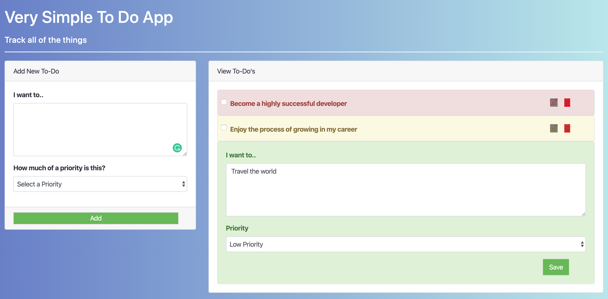

# React100-VSTDA



Final project in the San Diego Code School React 100 course. Was a very difficult challenge for me 
to overcome, but was successful in the end. First time using a CSS preprocessor and implementing 
a multiple file/component React app.

## Please feel free to demo the project by taking these steps..
```
Clone or fork the repo
```
```
npm install
```
```
npm start
```
```
Open your browser to view on localhost: 3000
```
* **Thank you**, ***-Miles Mickelson***
